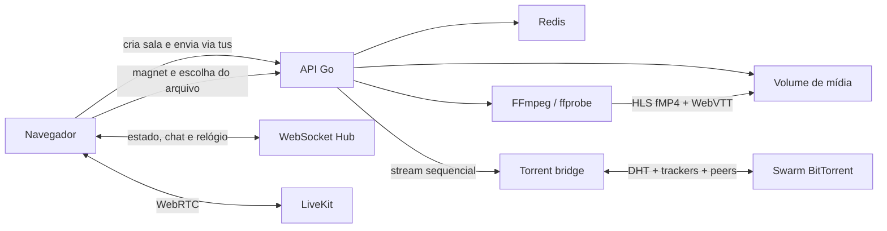

# ss.giuli.dev

[ss.giuli.dev](https://ss.giuli.dev) é uma aplicação de watch party: envie um vídeo ou abra um magnet, compartilhe a sala e assista com outras pessoas usando reprodução sincronizada, chat, múltiplos áudios, legendas e compartilhamento de tela.


## O que está pronto

- upload resumível com [tus](https://tus.io/) para arquivos de até 10 GB;
- início progressivo: o servidor começa a preparar HLS quando recebe o primeiro bloco configurado, sem esperar o upload inteiro;
- player responsivo com tela cheia, controles que somem durante a reprodução e suporte a HLS nativo ou `hls.js`;
- sincronização de play, pause, seek e velocidade por WebSocket;
- chat e lista de participantes por sala;
- seleção de faixas de áudio e legendas de texto;
- extração de legendas MKV no navegador e fallback de extração com FFmpeg no servidor;
- torrent baixado pelo servidor, não pelo navegador, com os arquivos `.srt` e `.ass` que acompanham o vídeo publicados durante o download;
- tela de espera com a fase da preparação e uma estimativa de quando dá para começar a assistir;
- torrents com seleção de arquivo e bridge híbrido para Chrome, Dia e Safari;
- entrada por link pedindo apenas o apelido, com aviso de quem entra e quem sai da sala;
- compartilhamento de tela com LiveKit;
- interface em português e inglês;
- histórico local de salas e metadados Open Graph, Twitter Card e oEmbed;
- catálogo buscável com fontes vindas de plugins que o host instala, num worker sem acesso a rede — o Torrentio é um deles e mora [num repositório à parte](https://github.com/DOG248/torrentioss); a documentação está em [ss.giuli.dev/docs](https://ss.giuli.dev/docs);
- métricas Prometheus enviadas para o Grafana Cloud, com painéis e alertas versionados no repositório.

## Como funciona



### Upload e disponibilidade progressiva

1. O navegador cria a sala com `POST /api/rooms`.
2. O arquivo é enviado em partes pelo protocolo tus.
3. Ao atingir `STREAM_START_MB`, o pipeline progressivo acompanha o arquivo crescente e alimenta o FFmpeg sem tratar um EOF temporário como fim do upload.
4. A sala passa para `ready` assim que existe o primeiro segmento HLS completo.
5. Quando o upload termina, uma segunda passagem produz o HLS VOD definitivo. A prévia continua disponível durante essa troca.

Um upload interrompido continua retomável pelo protocolo tus por `UPLOAD_IDLE_MINUTES`. Passado esse tempo sem receber bytes, os dados parciais são descartados e a sala é marcada como falha, em vez de ocupar espaço até o fim do TTL.

Nem toda fonte tem prévia. Um MP4 cujo átomo `moov` fica depois da mídia não tem nenhum prefixo decodificável, então o servidor lê o começo do arquivo, reconhece esse layout e diz isso na tela de espera, em vez de tentar analisar o arquivo a cada meio segundo até o download acabar. A reprodução começa na passagem final, como sempre.

A tela de espera mostra em qual fase a fonte está — recebendo, analisando, gerando o primeiro trecho — e estima quanto falta até dar para assistir, comparando a taxa observada com o tamanho derivado do bitrate que o `ffprobe` mediu. Os números vêm do servidor, então valem para todo mundo na sala e não só para a aba que enviou o arquivo.

Vídeos H.264 e HEVC são copiados quando possível. Outros codecs de vídeo são convertidos para H.264. As faixas de áudio são publicadas como AAC. A prévia usa segmentos de 2 segundos; o VOD final usa segmentos de 6 segundos.

### Torrents

O navegador não depende de peers WebRTC para abrir ou baixar um torrent, e não carrega os bytes. O fluxo principal usa o `torrent-bridge`, um processo Node/WebTorrent isolado que:

1. valida o magnet e mantém somente o info hash e o nome;
2. descobre metadados e peers por DHT e por uma whitelist de trackers;
3. devolve a lista de arquivos para o seletor;
4. seleciona o arquivo escolhido inteiro e entrega um stream sequencial, mantendo prioridade crítica logo à frente do ponto de leitura;
5. entrega também os arquivos de legenda que acompanham o vídeo, sem alterar a prioridade das peças do vídeo.

Depois que o arquivo é escolhido, o navegador entrega a sessão do bridge à API e sai do caminho: a API consome o stream e o envia ao próprio endpoint tus por loopback, reaproveitando a reserva de upload, o início progressivo, a conclusão e a limpeza de uploads abandonados que o upload comum já usa.

Isso importa por dois motivos medidos. Os bytes não atravessam mais a conexão de quem abriu a sala duas vezes, e a perna de subida do navegador era a mais estreita do caminho. E um stream único seleciona todas as peças restantes de uma vez: leituras por intervalo só conseguiam selecionar o intervalo pedido, então entre uma e outra o swarm ficava com dezenas de peers conectados e nada para baixar.

O fallback WebTorrent no navegador é usado apenas quando o bridge não está configurado; nesse caso o navegador volta a fazer o upload. A velocidade depende da disponibilidade e da distribuição das peças no swarm.

### Sincronização e controle

O primeiro membro criado com a sala é o controlador da reprodução. Somente ele publica play, pause, seek e alteração de velocidade; os demais clientes aplicam o estado recebido e corrigem drift com base no relógio do servidor. Não existe fluxo de “tomar o controle”.

Quem abre o link da sala só precisa informar o apelido; o link já é o convite e nenhum código adicional é pedido. Deixar o campo vazio gera um nome de convidado. Entradas e saídas aparecem como um aviso temporário e como uma linha no chat, comparando a lista de participantes que o servidor transmite.

O apelido é enviado no primeiro frame WebSocket e não aparece na URL. Capacidades sensíveis, como a autorização do LiveKit, são aleatórias, mantidas em memória e não são persistidas em query strings ou `localStorage`.

### Áudio e legendas

- Texto: ASS/SSA, SubRip, WebVTT e `mov_text` são convertidos para WebVTT.
- MKV: o navegador tenta extrair legendas de texto enquanto o upload continua.
- Torrent: os arquivos `.srt`, `.ass`, `.ssa` e `.vtt` que acompanham o vídeo são lidos inteiros pelo servidor, convertidos para WebVTT com FFmpeg e publicados quase imediatamente, sem esperar o vídeo. O idioma vem do nome do arquivo. As legendas embutidas no container saem da passagem final do FFmpeg e são numeradas antes das externas; as duas listas são unidas, então nenhuma das duas some quando o download termina.
- Fallback: depois do upload, FFmpeg extrai as faixas que ainda não foram fornecidas pelo cliente. Uma extração parcial publica as legendas já disponíveis sem cancelar essa passagem final.
- Imagem: PGS e VobSub são detectadas, mas não são exibidas; a interface informa quantas foram ignoradas.

## Executar com Docker

### Requisitos

- Docker Engine com Docker Compose v2;
- portas UDP acessíveis se o compartilhamento de tela for usado fora da máquina local;
- um navegador moderno.

Clone e inicie:

```bash
git clone git@github.com:giulianoo0/ss.git
cd ss
docker compose up --build
```

Acesse [http://localhost:8099](http://localhost:8099). O Compose inicia:

- `app`: frontend compilado, API Go, WebSocket e pipeline FFmpeg;
- `redis`: salas, participantes e estado sincronizado;
- `torrent-bridge`: cliente BitTorrent híbrido isolado;
- `livekit`: servidor WebRTC em modo de desenvolvimento;
- `alloy`: coletor que raspa as métricas da aplicação e as envia ao Grafana Cloud.

Para encerrar:

```bash
docker compose down
```

Os vídeos e segmentos ficam no volume `ss-data`. O cache transitório de torrents fica em `ss-torrent-cache`.

## Desenvolvimento local

### Backend

O backend requer Go 1.26, Redis e FFmpeg/ffprobe disponíveis no `PATH`.

```bash
go test ./...
go run ./cmd/server
```

Por padrão, o servidor escuta em `:8080`, usa `redis://localhost:6379`, grava em `/data` e procura o frontend compilado em `web/dist`.

### Frontend

```bash
cd web
npm ci
npm run dev
```

Validação completa do frontend:

```bash
npm test
npm run lint
npm run build
```

O Vite serve apenas o frontend durante o desenvolvimento. Para exercitar upload, WebSocket, mídia e torrents, execute também o backend e configure um proxy local ou use a build integrada do Docker.

## Configuração

| Variável | Padrão | Uso |
| --- | --- | --- |
| `PORT` | `8080` | Porta HTTP interna da aplicação. |
| `APP_BIND` | `127.0.0.1:8099` | Bind publicado pelo Docker Compose. |
| `DATA_DIR` | `/data` | Diretório de uploads, HLS e legendas. |
| `WEB_DIR` | `web/dist` | Diretório dos arquivos estáticos compilados. |
| `REDIS_URL` | `redis://localhost:6379` | Conexão Redis. |
| `MAX_UPLOAD_MB` | `10240` | Limite máximo por arquivo, em MiB. |
| `STREAM_START_MB` | `1` | Quantidade recebida antes de iniciar a prévia progressiva. |
| `ROOM_TTL_HOURS` | `5` | Vida útil da sala e da mídia. |
| `MAX_PARTICIPANTS` | `20` | Máximo de conexões simultâneas por sala. |
| `ROOM_IDLE_SECONDS` | `90` | Tempo sem participantes até a sala ser recolhida: registro no Redis, diretório em disco e mídia no bucket. |
| `UPLOAD_IDLE_MINUTES` | `10` | Tempo que um upload interrompido continua retomável antes de ser descartado. |
| `FFMPEG_JOBS` | `2` | Workers simultâneos em cada fila de mídia. |
| `METRICS_PORT` | `9090` | Porta do endpoint Prometheus, em um listener separado do da aplicação. `0` desliga o endpoint. |
| `TORRENT_BRIDGE_URL` | vazio | URL interna do bridge; o Compose usa `http://torrent-bridge:8090`. |
| `LIVEKIT_URL` | vazio | URL WebSocket entregue aos navegadores, normalmente `wss://...`. |
| `LIVEKIT_API_KEY` | vazio | Chave para emitir tokens LiveKit. |
| `LIVEKIT_API_SECRET` | vazio | Segredo para emitir tokens LiveKit. |
| `LIVEKIT_ARGS` | `--dev` no Compose | Argumentos do servidor LiveKit. |
| `ALLOY_BIND` | `127.0.0.1:12345` | Bind da interface de diagnóstico do coletor. |
| `GRAFANA_CLOUD_PROM_URL` | vazio | Endpoint de `remote_write` da instância de métricas do Grafana Cloud. |
| `GRAFANA_CLOUD_PROM_USER` | vazio | ID numérico dessa instância, usado como usuário do basic auth. |
| `GRAFANA_CLOUD_PROM_TOKEN` | vazio | Token da política de acesso, com escopo `metrics:write`. |
| `SS_INSTANCE` | `ss.giuli.dev` | Rótulo `instance` das séries enviadas. |
| `SS_ENV` | `production` | Rótulo `env` das séries enviadas. |

Valores inválidos em variáveis numéricas impedem a inicialização, em vez de cair silenciosamente para outro valor.

## Produção

O container `app` publica apenas em loopback por padrão. Coloque um proxy TLS, como Caddy ou nginx, na frente de `127.0.0.1:8099`. Para compartilhamento de tela, configure um endereço LiveKit público e exponha as portas RTC definidas no Compose (`7881/TCP` e `50000-50100/UDP`). Não use as credenciais de desenvolvimento em produção.

Exemplo mínimo de variáveis:

```dotenv
APP_BIND=127.0.0.1:8099
LIVEKIT_URL=wss://livekit.example.com
LIVEKIT_API_KEY=uma-chave-forte
LIVEKIT_API_SECRET=um-segredo-forte
LIVEKIT_ARGS=--config /etc/livekit.yaml
GRAFANA_CLOUD_PROM_URL=https://prometheus-<regiao>.grafana.net/api/prom/push
GRAFANA_CLOUD_PROM_USER=id-numerico-da-instancia
GRAFANA_CLOUD_PROM_TOKEN=token-da-politica-de-acesso
```

O arquivo de configuração do LiveKit e segredos deve ser montado com um override do Compose mantido fora do repositório.

Atualização manual da aplicação:

```bash
git pull --ff-only
docker compose build app torrent-bridge
docker compose up -d app torrent-bridge
docker compose ps
```

## Observabilidade

As métricas saem da aplicação em formato Prometheus e são enviadas para uma instância do Grafana Cloud. Não existe Prometheus nem Grafana no Compose: o armazenamento das séries e os painéis já estão do outro lado, e uma segunda cópia dos dois aqui gastaria memória para responder o que a instância já responde.

O endpoint fica em um listener próprio, na porta `METRICS_PORT`, publicado apenas na rede do Compose. O container `app` continua exposto só em loopback atrás do proxy TLS, e nada do que está em `/metrics` atravessa esse proxy. Não há segredo nas séries, mas elas dizem quantas pessoas estão assistindo e quanto a máquina está gastando, o que é assunto de quem opera e de mais ninguém. Uma porta igual à da aplicação impede a inicialização, em vez de publicar o endpoint junto com o site.

O `alloy` raspa esse endpoint a cada 15 segundos e faz `remote_write` para o Grafana Cloud. Ele é o sucessor do Grafana Agent, que chegou ao fim da vida em novembro de 2025 e não recebe mais correção de segurança. A configuração está em `observability/alloy/config.alloy`, é versionada e lê toda credencial do ambiente.

Banda vem de contadores. A aplicação conta bytes e nunca calcula taxa: quem transforma isso em bytes por segundo é o `rate()` no painel, na janela que quem está olhando escolher.

### O que é medido

- salas criadas, ativas, por estado e recolhidas, com o motivo — sala vazia ou fim do TTL;
- participantes conectados, entradas e saídas, conexões e mensagens WebSocket;
- bytes recebidos por tus, bytes de torrent, peers do swarm e transferências em andamento;
- jobs de FFmpeg por fila e por desfecho, com histograma de duração, tempo até a prévia ficar pronta e a proporção entre cópia e transcode;
- requisições HTTP por rota, status e duração, e os bytes que entram e saem em cada uma;
- operações no R2 por tipo e por classe de cobrança, com duração e erros.

Nenhum rótulo carrega ID de sala, apelido ou caminho de arquivo. Um rótulo sem limite é uma série nova por sala, e é assim que um endpoint de métricas vira a parte cara do servidor.

A classe de cada operação é o que a Cloudflare cobra por ela: Class A são escritas, listagens e cada parte de um multipart; Class B são leituras e metadados; `DeleteObject` e `AbortMultipartUpload` não são cobrados. A contagem é feita no transporte HTTP do cliente S3, e não em volta de `Put` e `RemovePrefix`, porque uma chamada dessas não é uma operação: um objeto acima do limite de parte única vira um multipart com uma escrita cobrada por parte, e remover um prefixo é uma listagem cobrada a cada mil chaves. Como segmentos e legendas são entregues pelo edge do bucket e não passam por esta máquina, as operações Class B são o que existe no lugar de uma medida de saída de mídia.

### Painéis e alertas

Os painéis ficam em `observability/dashboards/` e as regras de alerta em `observability/alerts/`, em JSON. O repositório é a fonte da verdade: o que for editado pela interface do Grafana é sobrescrito no envio seguinte.

```bash
set -a; . ./.env; set +a
./observability/grafana-sync.sh
```

O script cria a pasta, envia os painéis, cria ou atualiza as regras de alerta e, no fim, faz uma consulta instantânea no Grafana Cloud para conferir que as séries chegaram — um painel vazio não distingue "nada aconteceu" de "nada está sendo enviado".

São duas credenciais diferentes, e uma não serve para o trabalho da outra:

| Variável | Onde criar | Para quê |
| --- | --- | --- |
| `GRAFANA_CLOUD_PROM_TOKEN` | na instância, em **Administration → Cloud access policies**, com o escopo `metrics:write` | Envio das métricas. Não é aceito pela API do Grafana. |
| `GRAFANA_SA_TOKEN` | na instância, em **Administration → Users and access → Service accounts**, com o papel Editor | Pasta, painéis e regras de alerta. Não serve para enviar métricas. |

`GRAFANA_URL` é o endereço da instância, `https://<stack>.grafana.net`. As chaves de API do Grafana foram descontinuadas e migradas para contas de serviço, então é essa a forma atual. Nenhuma dessas variáveis entra no repositório: o `.gitignore` já exclui `.env`, e tanto o Compose quanto o script leem tudo do ambiente.

## API HTTP

Estas rotas atendem o cliente web e ainda não têm garantia de estabilidade como API pública.

| Método | Rota | Função |
| --- | --- | --- |
| `GET` | `/healthz` | Saúde do processo da aplicação. |
| `POST` | `/api/rooms` | Cria uma sala e devolve o endpoint tus. |
| `GET` | `/api/rooms/:id` | Consulta status, faixas e expiração. |
| `POST/PATCH/HEAD/DELETE` | `/api/upload/*` | Criação, continuação e encerramento de uploads tus. |
| `GET` | `/ws/rooms/:id` | WebSocket de presença, chat e reprodução. |
| `GET` | `/media/:id/hls/*` | Playlists e segmentos HLS. |
| `GET` | `/media/:id/subs/*` | Legendas WebVTT. |
| `POST` | `/api/rooms/:id/subtitles` | Recebe legendas extraídas pelo navegador. |
| `POST` | `/api/rooms/:id/screenshare/token` | Emite credencial LiveKit para um membro conectado. |
| `POST` | `/api/torrent-bridge/open` | Abre um magnet e retorna metadados. |
| `POST` | `/api/torrent-bridge/select` | Seleciona o arquivo da sessão. |
| `POST` | `/api/torrent-bridge/read` | Entrega um intervalo binário de até 8 MiB. |
| `POST` | `/api/torrent-bridge/read-file` | Lê outro arquivo do mesmo torrent, usado para legendas externas. |
| `POST` | `/api/torrent-bridge/stats` | Retorna peers, velocidade e progresso. |
| `POST` | `/api/torrent-bridge/close` | Fecha a sessão e limpa seu cache. |

## Persistência e segurança

- Salas e estado ficam no Redis com expiração.
- Uploads e derivados ficam em `DATA_DIR/rooms/<id>` e são removidos pelo sweeper após o TTL.
- O ID da sala funciona como link de acesso; não há contas ou ACL por usuário.
- Nomes de arquivo, apelidos, IDs, caminhos de mídia, legendas e ranges são validados e limitados.
- Rotas de API usam `Cache-Control: no-store`, `Referrer-Policy: no-referrer`, `X-Content-Type-Options: nosniff` e bloqueio de framing.
- O Gin não confia em cabeçalhos de proxy enviados pelo cliente.
- O bridge aceita somente magnets BTIH válidos, limita sessões e ranges e roda sem capabilities, com filesystem somente leitura e rede separada do Redis.
- Tokens LiveKit só são emitidos para membros que apresentem a capacidade efêmera recebida pelo WebSocket.

## Limitações conhecidas

- A disponibilidade de torrents depende do swarm. Metadados disponíveis não garantem que todas as peças do vídeo tenham seed.
- PGS e VobSub são legendas bitmap e não são renderizadas pelo player atual.
- A mídia é armazenada em volume local; múltiplas réplicas exigem storage compartilhado e coordenação adicional.
- O link da sala concede acesso a quem o possui.
- Alguns formatos MP4 precisam ser remuxados no navegador para permitir processamento progressivo.

## Estrutura do repositório

```text
bridge/              bridge BitTorrent em Node/WebTorrent
cmd/server/          entrada do servidor Go
internal/config/     configuração por ambiente
internal/httpapi/    rotas HTTP, mídia, legendas e LiveKit
internal/media/      probe, remux, HLS progressivo e filas
internal/metrics/    séries Prometheus expostas pelo servidor
internal/objectstore/ bucket R2 e a contagem das operações cobradas
internal/room/       modelo, Redis e expiração
internal/sync/       WebSocket, presença, chat e relógio
internal/upload/     integração tus
observability/       coletor, painéis, alertas e o script que os envia
web/src/             aplicação React/TypeScript
```

## Contribuindo

Antes de abrir um pull request:

```bash
go test ./...
cd web
npm test
npm run lint
npm run build
```

Inclua testes para mudanças de comportamento e não versione arquivos de mídia, caches, `.env` ou segredos.
