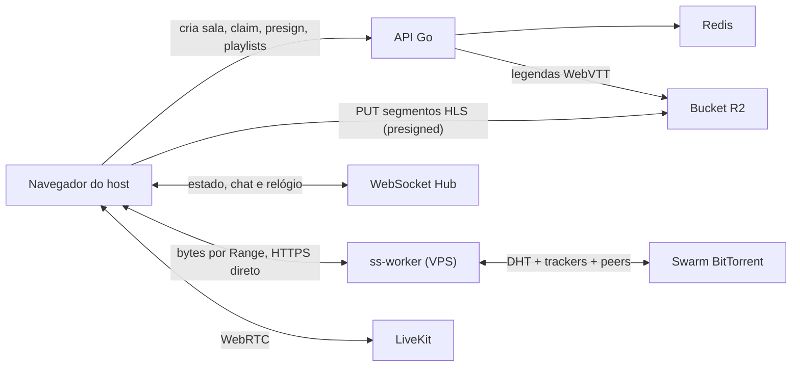

# juntos.lol

[juntos.lol](https://juntos.lol) é uma aplicação de watch party: envie um vídeo ou abra um magnet, compartilhe a sala e assista com outras pessoas usando reprodução sincronizada, chat, múltiplos áudios, legendas e compartilhamento de tela.


## O que está pronto

- o vídeo é preparado no navegador de quem abre a sala: remux para HLS com [mediabunny](https://mediabunny.dev) e envio dos segmentos direto para o bucket, sem nenhum byte de vídeo e nenhum ffmpeg no servidor;
- início progressivo: a sala começa a tocar com os primeiros segmentos publicados, sem esperar o remux inteiro;
- player responsivo com tela cheia, controles que somem durante a reprodução e suporte a HLS nativo ou `hls.js`;
- sincronização de play, pause, seek e velocidade por WebSocket;
- chat e lista de participantes por sala;
- seleção de faixas de áudio e legendas de texto;
- extração de legendas MKV no navegador, publicadas enquanto o remux continua;
- torrent baixado por workers remotos (ss-worker) que o servidor despacha, sem nada para instalar, com os arquivos `.srt` e `.ass` que acompanham o vídeo publicados durante o download;
- tela de espera com a fase da preparação e uma estimativa de quando dá para começar a assistir;
- torrents com seleção de arquivo, sem nenhum download no servidor;
- entrada por link pedindo apenas o apelido, com aviso de quem entra e quem sai da sala;
- compartilhamento de tela com LiveKit;
- interface em português e inglês;
- histórico local de salas e metadados Open Graph, Twitter Card e oEmbed;
- catálogo buscável com fontes vindas de plugins que o host instala, num worker sem acesso a rede; a documentação está em [juntos.lol/docs](https://juntos.lol/docs);
- métricas Prometheus enviadas para o Grafana Cloud, com painéis e alertas versionados no repositório.

## Como funciona



### Preparação do vídeo, no navegador do host

O servidor não processa vídeo. Tudo que custa CPU acontece na máquina de quem abre a sala:

1. O navegador cria a sala com `POST /api/rooms` e reivindica o direito de produzir a mídia dela (`/client-media/claim`).
2. O [mediabunny](https://mediabunny.dev) lê a fonte — arquivo local, torrent via ss-worker ou url de um plugin — copia o vídeo (H.264, HEVC, VP9, AV1), transcodifica o áudio para AAC e muxa CMAF/HLS em segmentos de 4 segundos.
3. Cada segmento é enviado por `PUT` direto ao bucket, com uma URL assinada pelo servidor (`/client-media/presign`).
4. A cada poucos segundos o navegador entrega as playlists (`/client-media/publish`). O servidor confirma no bucket que cada objeto nomeado existe antes de publicar, então um viewer nunca recebe uma URL que dá 404.
5. A sala passa para `ready` no primeiro segmento confirmado; o remux continua por trás.

O host também toca do próprio remux, pelo MediaSource, sem esperar o bucket.

Uma fonte que o navegador não consegue preparar — codec que ele não decodifica, container que não lê — não abre sala: a tela diz isso e não há servidor para cair de volta. Um claim sem atividade por `UPLOAD_IDLE_MINUTES` é devolvido pelo sweeper, para uma sala abandonada no meio não ficar travada até o TTL.

### Torrents

O servidor não baixa torrent nenhum, e quem abre a sala não instala nada. Um magnet é despachado pelo servidor a um **ss-worker**: um binário Rust (`ss-worker/`) que roda numa VPS própria, entra no swarm e serve os bytes ao navegador do host por HTTPS `Range`, direto, sem passar pelo servidor. O remux continua no navegador; os viewers tocam do bucket e nunca tocam o worker.

1. O navegador registra o infohash em `POST /api/torrents` (com uma sessão anônima e uma cota por sessão). O servidor escolhe um worker — de preferência um que já tenha o torrent — e assina o job com Ed25519.
2. O worker resolve os metadados no swarm e devolve a lista de arquivos; o navegador faz poll em `GET /api/torrents/{jobId}` até ela chegar.
3. `POST /api/torrents/{jobId}/select` escolhe o arquivo; o worker reserva o disco e prioriza as peças, e o servidor devolve um `readBase` e um ticket assinado, com validade curta e renovado por `POST /api/torrents/{jobId}/token` enquanto o remux durar.
4. O navegador lê `GET {readBase}/v1/f/{ticket}` com `Range`; o worker responde 206 à medida que as peças chegam, com cap por resposta e `Content-Range` honesto, e o leitor retoma de onde parou. O offset de leitura do remux vai ao worker como hint para o swarm buscar à frente dele.
5. As legendas que acompanham o vídeo são lidas do mesmo worker (`/v1/file/{ticket}/{índice}`) e publicadas junto.

Os workers discam o servidor por WSS (`/ws/worker-link`), se registram uma vez com `WORKER_ENROLLMENT_SECRET` e depois provam a própria chave; reportam disco, leases e peers a cada dez segundos. Um worker sem cert válido, cheio ou drenando não recebe job. Certificados vêm do Let's Encrypt por ACME, para o IP da VPS ou um nome, sem DNS obrigatório. Sem worker conectado, o caminho de magnet se declara indisponível (`GET /api/torrents/capacity`) e a página diz isso; não há fallback no servidor nem no navegador.

### Sincronização e controle

O primeiro membro criado com a sala é o controlador da reprodução. Somente ele publica play, pause, seek e alteração de velocidade; os demais clientes aplicam o estado recebido e corrigem drift com base no relógio do servidor. Não existe fluxo de “tomar o controle”.

Quem abre o link da sala só precisa informar o apelido; o link já é o convite e nenhum código adicional é pedido. Deixar o campo vazio gera um nome de convidado. Entradas e saídas aparecem como um aviso temporário e como uma linha no chat, comparando a lista de participantes que o servidor transmite.

O apelido é enviado no primeiro frame WebSocket e não aparece na URL. Capacidades sensíveis, como a autorização do LiveKit, são aleatórias, mantidas em memória e não são persistidas em query strings ou `localStorage`.

### Áudio e legendas

- Texto: ASS/SSA, SubRip, WebVTT e `mov_text` são convertidos para WebVTT.
- MKV: o navegador extrai as legendas de texto numa passagem sequencial sobre a fonte, em paralelo ao remux.
- Torrent: os arquivos `.srt`, `.ass`, `.ssa` e `.vtt` que acompanham o vídeo são lidos do worker, convertidos para WebVTT no navegador e publicados quase imediatamente, sem esperar o vídeo. O idioma vem do nome do arquivo.
- O servidor só recebe WebVTT pronto (`POST /api/rooms/:id/subtitles`) e o repassa ao bucket.
- Imagem: PGS e VobSub são detectadas, mas não são exibidas; a interface informa quantas foram ignoradas.

## Executar com Docker

### Requisitos

- Docker Engine com Docker Compose v2;
- portas UDP acessíveis se o compartilhamento de tela for usado fora da máquina local;
- um navegador moderno.

Clone e inicie:

```bash
git clone git@github.com:giulianoo0/ss.git
cd ss
docker compose up --build
```

Acesse [http://localhost:8099](http://localhost:8099). O Compose inicia:

- `app`: frontend compilado, API Go e WebSocket;
- `redis`: salas, participantes e estado sincronizado;
- `livekit`: servidor WebRTC em modo de desenvolvimento;
- `alloy`: coletor que raspa as métricas da aplicação e as envia ao Grafana Cloud.

Para encerrar:

```bash
docker compose down
```

O volume `ss-data` guarda só as legendas antes de subirem ao bucket; vídeo e segmentos nunca passam pelo servidor.

## Desenvolvimento local

### Backend

O backend requer Go 1.26 e Redis. Não há ffmpeg.

```bash
go test ./...
go run ./cmd/server
```

Por padrão, o servidor escuta em `:8080`, usa `redis://localhost:6379`, grava em `/data` e procura o frontend compilado em `web/dist`.

### Frontend

```bash
cd web
npm ci
npm run dev
```

Validação completa do frontend:

```bash
npm test
npm run lint
npm run build
```

O Vite serve apenas o frontend durante o desenvolvimento. Para exercitar upload, WebSocket, mídia e torrents, execute também o backend e configure um proxy local ou use a build integrada do Docker.

## Configuração

| Variável | Padrão | Uso |
| --- | --- | --- |
| `PORT` | `8080` | Porta HTTP interna da aplicação. |
| `APP_BIND` | `127.0.0.1:8099` | Bind publicado pelo Docker Compose. |
| `DATA_DIR` | `/data` | Diretório de trabalho das legendas. |
| `WEB_DIR` | `web/dist` | Diretório dos arquivos estáticos compilados. |
| `REDIS_URL` | `redis://localhost:6379` | Conexão Redis. |
| `MAX_UPLOAD_MB` | `51200` | Orçamento de bytes que um remux pode publicar, em MiB. |
| `ROOM_TTL_HOURS` | `5` | Vida útil da sala e da mídia. |
| `MAX_PARTICIPANTS` | `20` | Máximo de conexões simultâneas por sala. |
| `ROOM_IDLE_SECONDS` | `90` | Tempo sem participantes até a sala ser recolhida: registro no Redis, diretório em disco e mídia no bucket. |
| `UPLOAD_IDLE_MINUTES` | `10` | Tempo sem atividade até o claim de um remux ser devolvido. |
| `METRICS_PORT` | `9090` | Porta do endpoint Prometheus, em um listener separado do da aplicação. `0` desliga o endpoint. |
| `LIVEKIT_URL` | vazio | URL WebSocket entregue aos navegadores, normalmente `wss://...`. |
| `LIVEKIT_API_KEY` | vazio | Chave para emitir tokens LiveKit. |
| `LIVEKIT_API_SECRET` | vazio | Segredo para emitir tokens LiveKit. |
| `LIVEKIT_ARGS` | `--dev` no Compose | Argumentos do servidor LiveKit. |
| `ALLOY_BIND` | `127.0.0.1:12345` | Bind da interface de diagnóstico do coletor. |
| `GRAFANA_CLOUD_PROM_URL` | vazio | Endpoint de `remote_write` da instância de métricas do Grafana Cloud. |
| `GRAFANA_CLOUD_PROM_USER` | vazio | ID numérico dessa instância, usado como usuário do basic auth. |
| `GRAFANA_CLOUD_PROM_TOKEN` | vazio | Token da política de acesso, com escopo `metrics:write`. |
| `SS_INSTANCE` | `juntos.lol` | Rótulo `instance` das séries enviadas. |
| `SS_ENV` | `production` | Rótulo `env` das séries enviadas. |

Valores inválidos em variáveis numéricas impedem a inicialização, em vez de cair silenciosamente para outro valor.

`PLUGIN_FETCH_PROXY` (opcional) é um proxy `http`, `https` ou `socks5` por onde saem as requisições que o servidor faz em nome dos plugins (`GET /api/plugins/fetch`). Serve para quando um addon recusa o endereço da própria instância — o Torrentio bloqueia faixas de datacenter — e a saída precisa vir de outro lugar. A resolução de nomes passa a acontecer no proxy, então a guarda contra endereços privados vale para a rede dele; a política de URL (só `https`, só nomes, nunca o próprio servidor, em cada redirect) continua aqui.

## Produção

O container `app` publica apenas em loopback por padrão. Coloque um proxy TLS, como Caddy ou nginx, na frente de `127.0.0.1:8099`. Para compartilhamento de tela, configure um endereço LiveKit público e exponha as portas RTC definidas no Compose (`7881/TCP` e `50000-50100/UDP`). Não use as credenciais de desenvolvimento em produção.

Exemplo mínimo de variáveis:

```dotenv
APP_BIND=127.0.0.1:8099
LIVEKIT_URL=wss://livekit.example.com
LIVEKIT_API_KEY=uma-chave-forte
LIVEKIT_API_SECRET=um-segredo-forte
LIVEKIT_ARGS=--config /etc/livekit.yaml
GRAFANA_CLOUD_PROM_URL=https://prometheus-<regiao>.grafana.net/api/prom/push
GRAFANA_CLOUD_PROM_USER=id-numerico-da-instancia
GRAFANA_CLOUD_PROM_TOKEN=token-da-politica-de-acesso
```

O arquivo de configuração do LiveKit e segredos deve ser montado com um override do Compose mantido fora do repositório.

Atualização manual da aplicação. O diretório no servidor **não é um clone git** — é uma cópia publicada via `rsync`, então `git pull` lá não existe. Os excludes protegem os três arquivos que só existem no servidor (`.env`, `docker-compose.override.yml`, `livekit.yaml`); sem eles o `--delete` os apagaria e a stack subiria sem credenciais:

```bash
rsync -az --delete \
  --exclude .git/ --exclude web/node_modules/ --exclude web/dist/ --exclude data/ \
  --exclude .env --exclude docker-compose.override.yml --exclude livekit.yaml \
  ./ usuario@servidor:/opt/ss/
ssh usuario@servidor 'cd /opt/ss \
  && docker compose build app \
  && docker compose up -d app \
  && docker compose ps'
```

## Observabilidade

As métricas saem da aplicação em formato Prometheus e são enviadas para uma instância do Grafana Cloud. Não existe Prometheus nem Grafana no Compose: o armazenamento das séries e os painéis já estão do outro lado, e uma segunda cópia dos dois aqui gastaria memória para responder o que a instância já responde.

O endpoint fica em um listener próprio, na porta `METRICS_PORT`, publicado apenas na rede do Compose. O container `app` continua exposto só em loopback atrás do proxy TLS, e nada do que está em `/metrics` atravessa esse proxy. Não há segredo nas séries, mas elas dizem quantas pessoas estão assistindo e quanto a máquina está gastando, o que é assunto de quem opera e de mais ninguém. Uma porta igual à da aplicação impede a inicialização, em vez de publicar o endpoint junto com o site.

O `alloy` raspa esse endpoint a cada 15 segundos e faz `remote_write` para o Grafana Cloud. Ele é o sucessor do Grafana Agent, que chegou ao fim da vida em novembro de 2025 e não recebe mais correção de segurança. A configuração está em `observability/alloy/config.alloy`, é versionada e lê toda credencial do ambiente.

Banda vem de contadores. A aplicação conta bytes e nunca calcula taxa: quem transforma isso em bytes por segundo é o `rate()` no painel, na janela que quem está olhando escolher.

### O que é medido

- salas criadas, ativas, por estado e recolhidas, com o motivo — sala vazia ou fim do TTL;
- participantes conectados, entradas e saídas, conexões e mensagens WebSocket;
- bytes assinados para o pipeline do cliente e objetos confirmados no bucket;
- requisições HTTP por rota, status e duração, e os bytes que entram e saem em cada uma;
- operações no R2 por tipo e por classe de cobrança, com duração e erros.

Nenhum rótulo carrega ID de sala, apelido ou caminho de arquivo. Um rótulo sem limite é uma série nova por sala, e é assim que um endpoint de métricas vira a parte cara do servidor.

A classe de cada operação é o que a Cloudflare cobra por ela: Class A são escritas, listagens e cada parte de um multipart; Class B são leituras e metadados; `DeleteObject` e `AbortMultipartUpload` não são cobrados. A contagem é feita no transporte HTTP do cliente S3, e não em volta de `Put` e `RemovePrefix`, porque uma chamada dessas não é uma operação: um objeto acima do limite de parte única vira um multipart com uma escrita cobrada por parte, e remover um prefixo é uma listagem cobrada a cada mil chaves. Como segmentos e legendas são entregues pelo edge do bucket e não passam por esta máquina, as operações Class B são o que existe no lugar de uma medida de saída de mídia.

### Painéis e alertas

Os painéis ficam em `observability/dashboards/` e as regras de alerta em `observability/alerts/`, em JSON. O repositório é a fonte da verdade: o que for editado pela interface do Grafana é sobrescrito no envio seguinte.

```bash
set -a; . ./.env; set +a
./observability/grafana-sync.sh
```

O script cria a pasta, envia os painéis, cria ou atualiza as regras de alerta e, no fim, faz uma consulta instantânea no Grafana Cloud para conferir que as séries chegaram — um painel vazio não distingue "nada aconteceu" de "nada está sendo enviado".

São duas credenciais diferentes, e uma não serve para o trabalho da outra:

| Variável | Onde criar | Para quê |
| --- | --- | --- |
| `GRAFANA_CLOUD_PROM_TOKEN` | na instância, em **Administration → Cloud access policies**, com o escopo `metrics:write` | Envio das métricas. Não é aceito pela API do Grafana. |
| `GRAFANA_SA_TOKEN` | na instância, em **Administration → Users and access → Service accounts**, com o papel Editor | Pasta, painéis e regras de alerta. Não serve para enviar métricas. |

`GRAFANA_URL` é o endereço da instância, `https://<stack>.grafana.net`. As chaves de API do Grafana foram descontinuadas e migradas para contas de serviço, então é essa a forma atual. Nenhuma dessas variáveis entra no repositório: o `.gitignore` já exclui `.env`, e tanto o Compose quanto o script leem tudo do ambiente.

## API HTTP

Estas rotas atendem o cliente web e ainda não têm garantia de estabilidade como API pública.

| Método | Rota | Função |
| --- | --- | --- |
| `GET` | `/healthz` | Saúde do processo da aplicação. |
| `POST` | `/api/rooms` | Cria uma sala. |
| `GET` | `/api/rooms/:id` | Consulta status, faixas e expiração. |
| `GET` | `/ws/rooms/:id` | WebSocket de presença, chat e reprodução. |
| `GET` | `/media/:id/hls/*` | Playlists e segmentos HLS. |
| `GET` | `/media/:id/subs/*` | Legendas WebVTT. |
| `POST` | `/api/rooms/:id/subtitles` | Recebe legendas extraídas pelo navegador. |
| `POST` | `/api/rooms/:id/screenshare/token` | Emite credencial LiveKit para um membro conectado. |
| `GET` | `/api/plugins/fetch?url=` | Faz, em nome de um plugin, a requisição que o navegador não consegue fazer sem carimbar a própria origem. Só `https`, só nomes que resolvem para endereço público, corpo limitado, com sessão e cota por hora. |

## Persistência e segurança

- Salas e estado ficam no Redis com expiração.
- A mídia de cada sala fica no bucket em `rooms/<id>/g<geração>/` e é removida pelo sweeper após o TTL.
- O ID da sala funciona como link de acesso; não há contas ou ACL por usuário.
- Nomes de arquivo, apelidos, IDs, caminhos de mídia, legendas e ranges são validados e limitados.
- Rotas de API usam `Cache-Control: no-store`, `Referrer-Policy: no-referrer`, `X-Content-Type-Options: nosniff` e bloqueio de framing.
- O Gin não confia em cabeçalhos de proxy enviados pelo cliente.
- Tokens LiveKit só são emitidos para membros que apresentem a capacidade efêmera recebida pelo WebSocket.

## Limitações conhecidas

- Torrents exigem ao menos um ss-worker conectado ao servidor, e a disponibilidade depende do swarm. Metadados disponíveis não garantem que todas as peças do vídeo tenham seed.
- PGS e VobSub são legendas bitmap e não são renderizadas pelo player atual.
- O link da sala concede acesso a quem o possui.
- Só navegadores capazes de remuxar (WebCodecs para decodificar o áudio, AAC para codificar) abrem sala com vídeo. Quem assiste não precisa de nada disso.

## Estrutura do repositório

```text
cmd/server/          entrada do servidor Go
internal/config/     configuração por ambiente
internal/httpapi/    rotas HTTP, mídia, legendas e LiveKit
internal/media/      o lado servidor do pipeline do cliente: validação e render de playlists, publicação de legendas
internal/metrics/    séries Prometheus expostas pelo servidor
internal/objectstore/ bucket R2 e a contagem das operações cobradas
internal/room/       modelo, Redis e expiração
internal/sync/       WebSocket, presença, chat e relógio
observability/       coletor, painéis, alertas e o script que os envia
web/src/             aplicação React/TypeScript
```

## Contribuindo

Antes de abrir um pull request:

```bash
go test ./...
cd web
npm test
npm run lint
npm run build
```

Inclua testes para mudanças de comportamento e não versione arquivos de mídia, caches, `.env` ou segredos.
